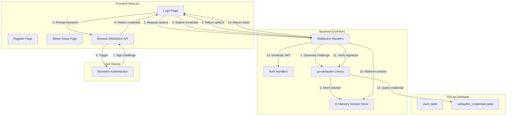

# Design Document: WebAuthn Face Authentication

## Overview

This design implements passwordless biometric authentication using the WebAuthn standard for the chat application. The system enables users to register and log in using device-based authenticators (Face ID, Windows Hello, fingerprint readers) while maintaining full backward compatibility with existing password-based authentication.

The implementation follows a client-server architecture where the backend (Go/Fiber) acts as the WebAuthn Relying Party, and the frontend (Next.js/React) interfaces with the browser's WebAuthn API. The design emphasizes security through challenge-response authentication, credential uniqueness enforcement, and secure admin account provisioning.

Key design decisions:
- **In-memory session store**: Challenges are stored in memory with mutex protection for simplicity and automatic cleanup. This is acceptable because challenges are short-lived (5 minutes) and losing them on server restart only requires users to retry authentication.
- **Credential uniqueness**: Enforced at both database (unique constraint) and application level to prevent multi-account abuse.
- **Backward compatibility**: WebAuthn credentials are stored in a separate table, leaving the existing users table and password authentication flow untouched.
- **Admin setup**: Uses a secret token-based flow to enable secure one-time admin account creation without exposing a public endpoint.

## Architecture

### System Components



### Data Flow

**Registration Flow:**
1. User clicks "Register with Face ID" on frontend
2. Frontend calls `/auth/webauthn/register/begin` with username and display_name
3. Backend validates uniqueness, generates challenge, stores in session store
4. Backend returns registration options (challenge, RP info, user details)
5. Frontend invokes `navigator.credentials.create()` with options
6. Browser prompts for biometric authentication
7. Authenticator creates key pair, signs challenge with private key
8. Browser returns credential (public key, credential ID, signature)
9. Frontend posts credential to `/auth/webauthn/register/finish`
10. Backend retrieves session, verifies signature matches challenge
11. Backend checks credential ID uniqueness
12. Backend creates user account, stores credential, generates JWT
13. Frontend stores JWT and redirects to chat

**Login Flow:**
1. User clicks "Sign in with Face ID" on frontend
2. Frontend calls `/auth/webauthn/login/begin` with username
3. Backend loads user's credentials, generates challenge, stores in session
4. Backend returns login options (challenge, allowed credential IDs)
5. Frontend invokes `navigator.credentials.get()` with options
6. Browser prompts for biometric authentication
7. Authenticator signs challenge with stored private key
8. Browser returns assertion (credential ID, signature)
9. Frontend posts assertion to `/auth/webauthn/login/finish`
10. Backend retrieves session, verifies signature with stored public key
11. Backend updates last_seen, generates JWT
12. Frontend stores JWT and redirects to chat

### Security Architecture

**Challenge Management:**
- Challenges are cryptographically random 32-byte values generated by the go-webauthn library
- Stored in memory with 5-minute expiration
- Deleted immediately after use (success or failure)
- Protected by mutex locks to prevent race conditions

**Credential Storage:**
- Public keys stored as JSON in `webauthn_credentials.credential_data`
- Private keys never leave the user's device (stored in secure enclave/TPM)
- Credential IDs are unique across the system (database constraint + application check)

**Admin Account Security:**
- Admin setup endpoint requires `X-Admin-Setup-Token` header
- Token must match `ADMIN_SETUP_TOKEN` environment variable
- Endpoint only allows registration if no admin exists
- Admin accounts are not added to Main_Group_Chat automatically

## Components and Interfaces

### Backend Components

#### WebAuthn Handlers (`backend/handlers/webauthn.go`)

**WAUser struct** - Implements `webauthn.User` interface:
```go
type WAUser struct {
    UserID      int
    Username    string
    DisplayName string
    Credentials []webauthn.Credential
}

// Interface methods
func (u *WAUser) WebAuthnID() []byte
func (u *WAUser) WebAuthnName() string
func (u *WAUser) WebAuthnDisplayName() string
func (u *WAUser) WebAuthnCredentials() []webauthn.Credential
```

**Session Store** - In-memory challenge storage:
```go
type waSession struct {
    data        webauthn.SessionData
    userID      int
    username    string
    displayName string
    role        string
    createdAt   time.Time
}

var (
    waSessions   = make(map[string]*waSession)
    waSessionsMu sync.Mutex
)

func waStore(s *waSession) string
func waGet(id string) (*waSession, bool)
func waDel(id string)
```

**HTTP Endpoints:**

`POST /auth/webauthn/register/begin`
- Request: `{username: string, display_name: string}`
- Response: `{session_id: string, options: PublicKeyCredentialCreationOptions}`
- Validates username/display_name uniqueness
- Generates challenge and registration options
- Returns session ID for finish step

`POST /auth/webauthn/register/finish`
- Request: `{session_id: string, credential: PublicKeyCredential}`
- Response: `{access_token: string, user: {user_id, username, display_name, role}}`
- Verifies credential signature
- Checks credential ID uniqueness
- Creates user account and stores credential
- Returns JWT token

`POST /auth/webauthn/login/begin`
- Request: `{username: string}`
- Response: `{session_id: string, options: PublicKeyCredentialRequestOptions}`
- Loads user's credentials
- Generates challenge and login options
- Returns session ID for finish step

`POST /auth/webauthn/login/finish`
- Request: `{session_id: string, credential: PublicKeyCredential}`
- Response: `{access_token: string, user: {user_id, username, display_name, role}}`
- Verifies assertion signature
- Updates last_seen timestamp
- Returns JWT token

`POST /auth/admin-setup/begin`
- Headers: `X-Admin-Setup-Token: <secret>`
- Request: `{username: string, display_name: string}`
- Response: `{session_id: string, options: PublicKeyCredentialCreationOptions}`
- Validates admin setup token
- Checks no admin exists
- Generates challenge with role="admin"

#### WebAuthn Library Wrapper (`backend/wauthn/wauthn.go`)

```go
var WA *webauthn.WebAuthn

func Init() error {
    rpID := os.Getenv("WEBAUTHN_RP_ID")        // e.g., "example.com"
    rpOrigin := os.Getenv("WEBAUTHN_RP_ORIGIN") // e.g., "https://example.com"
    
    WA, err = webauthn.New(&webauthn.Config{
        RPDisplayName: "ChatApp",
        RPID:          rpID,
        RPOrigins:     []string{rpOrigin},
    })
    return err
}
```

Configuration:
- `WEBAUTHN_RP_ID`: Domain name (e.g., "localhost" for dev, "example.com" for prod)
- `WEBAUTHN_RP_ORIGIN`: Full origin URL (e.g., "http://localhost:3000" for dev, "https://example.com" for prod)
- `ADMIN_SETUP_TOKEN`: Secret token for admin account creation

### Frontend Components

#### Login Page (`frontend/app/login/page.jsx`)

Additions:
- "Sign in with Face ID" button (shown if WebAuthn supported)
- WebAuthn login flow handler
- Error display for WebAuthn-specific errors
- Fallback to password login

```javascript
const handleWebAuthnLogin = async () => {
  // 1. Call /auth/webauthn/login/begin
  const { data } = await api.post('/auth/webauthn/login/begin', { username });
  
  // 2. Invoke browser WebAuthn API
  const credential = await navigator.credentials.get({
    publicKey: data.options.publicKey
  });
  
  // 3. Submit credential to /auth/webauthn/login/finish
  const { data: result } = await api.post('/auth/webauthn/login/finish', {
    session_id: data.session_id,
    credential: credential
  });
  
  // 4. Store token and redirect
  localStorage.setItem('token', result.access_token);
  router.push('/chat');
};
```

#### Register Page (`frontend/app/register/page.jsx`)

Additions:
- "Register with Face ID" button (shown if WebAuthn supported)
- Display name selection (existing functionality)
- WebAuthn registration flow handler
- Error display for WebAuthn-specific errors

```javascript
const handleWebAuthnRegister = async () => {
  // 1. Call /auth/webauthn/register/begin
  const { data } = await api.post('/auth/webauthn/register/begin', {
    username,
    display_name: displayName
  });
  
  // 2. Invoke browser WebAuthn API
  const credential = await navigator.credentials.create({
    publicKey: data.options.publicKey
  });
  
  // 3. Submit credential to /auth/webauthn/register/finish
  const { data: result } = await api.post('/auth/webauthn/register/finish', {
    session_id: data.session_id,
    credential: credential
  });
  
  // 4. Store token and redirect
  localStorage.setItem('token', result.access_token);
  router.push('/chat');
};
```

#### Admin Setup Page (`frontend/app/admin-setup/page.jsx`)

New page for admin account creation:
- Token input field
- Username and display name inputs
- "Create Admin Account with Face ID" button
- WebAuthn registration flow with token header

```javascript
const handleAdminSetup = async () => {
  // 1. Call /auth/admin-setup/begin with token header
  const { data } = await api.post('/auth/admin-setup/begin', {
    username,
    display_name: displayName
  }, {
    headers: { 'X-Admin-Setup-Token': setupToken }
  });
  
  // 2. Invoke browser WebAuthn API
  const credential = await navigator.credentials.create({
    publicKey: data.options.publicKey
  });
  
  // 3. Submit credential to /auth/webauthn/register/finish
  const { data: result } = await api.post('/auth/webauthn/register/finish', {
    session_id: data.session_id,
    credential: credential
  });
  
  // 4. Redirect to login
  router.push('/login');
};
```

#### API Client (`frontend/lib/api.js`)

New exports:
```javascript
export const webauthnAPI = {
  registerBegin: (username, displayName) => 
    api.post('/auth/webauthn/register/begin', { username, display_name: displayName }),
  
  registerFinish: (sessionId, credential) => 
    api.post('/auth/webauthn/register/finish', { session_id: sessionId, credential }),
  
  loginBegin: (username) => 
    api.post('/auth/webauthn/login/begin', { username }),
  
  loginFinish: (sessionId, credential) => 
    api.post('/auth/webauthn/login/finish', { session_id: sessionId, credential }),
  
  adminSetupBegin: (username, displayName, token) => 
    api.post('/auth/admin-setup/begin', { username, display_name: displayName }, {
      headers: { 'X-Admin-Setup-Token': token }
    }),
};
```

## Data Models

### Database Schema

**webauthn_credentials table** (already exists in schema.go):
```sql
CREATE TABLE IF NOT EXISTS webauthn_credentials (
    id              INTEGER PRIMARY KEY AUTOINCREMENT,
    user_id         INTEGER NOT NULL REFERENCES users(user_id) ON DELETE CASCADE,
    credential_id   TEXT NOT NULL UNIQUE,
    credential_data TEXT NOT NULL,
    created_at      DATETIME DEFAULT CURRENT_TIMESTAMP
);
```

Fields:
- `id`: Auto-incrementing primary key
- `user_id`: Foreign key to users table (cascade delete)
- `credential_id`: Unique identifier for the credential (base64-encoded)
- `credential_data`: JSON-serialized `webauthn.Credential` object containing public key, attestation type, AAGUID, sign count
- `created_at`: Timestamp of credential creation

**users table** (no changes required):
- Existing `password_hash` field remains for backward compatibility
- WebAuthn-only users will have empty string for `password_hash`
- `role` field distinguishes admin from regular users

### Credential Data Structure

The `credential_data` column stores a JSON-serialized `webauthn.Credential`:
```json
{
  "id": "base64-encoded-credential-id",
  "publicKey": "base64-encoded-public-key",
  "attestationType": "none",
  "transport": ["internal"],
  "flags": {
    "userPresent": true,
    "userVerified": true
  },
  "authenticator": {
    "aaguid": "00000000-0000-0000-0000-000000000000",
    "signCount": 0
  }
}
```

### Session Data Structure

In-memory session store:
```go
type waSession struct {
    data        webauthn.SessionData  // Challenge, user verification, extensions
    userID      int                   // -1 for registration, actual ID for login
    username    string                // For registration and login
    displayName string                // For registration only
    role        string                // "user" or "admin"
    createdAt   time.Time             // For expiration tracking
}
```

Session lifecycle:
- Created in `begin` endpoint
- Retrieved in `finish` endpoint
- Deleted after use or after 5 minutes
- Cleaned up by background goroutine every minute


## Correctness Properties

*A property is a characteristic or behavior that should hold true across all valid executions of a system—essentially, a formal statement about what the system should do. Properties serve as the bridge between human-readable specifications and machine-verifiable correctness guarantees.*

Before defining properties, I'll analyze each acceptance criterion for testability:

